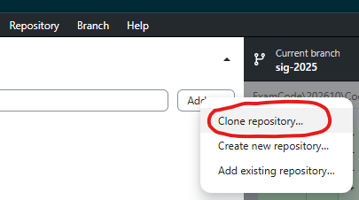
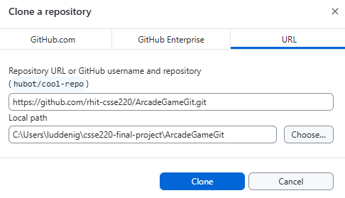
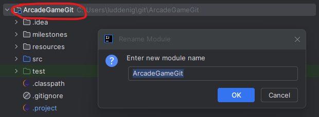

# Using Git for Your Final Project

For the final project, you will be doing group development.
Therefore, we'll be asking you to use a source control system called
git.  You've already used git to checkout code/homework from the
CSSE220 repo, but for this project you will be managing a repo.

# Step #1: Create an Account and Create/Join Team
[Instructions](https://docs.google.com/document/d/1L9aUwMvniMmx79O7JsLlsOXOur_VRoDLkfEN9qzDcnI/edit)

1. Create a GitHub Account (if not already done)
2. Accept the GitHub classroom assignment
3. Create or join the appropriate Team

# Step #2: Setting Up PATs for Cloning the Repo

[Setup Personal Access Token (PAT) for GitHub](https://docs.google.com/document/d/1HD18gxAwSevFrFW-OOXy_mlbXAxxkphD2Tbz0eKo5Rk/edit?usp=sharing)

You might not be able to clone the repo without doing this. 

# Step 3: Cloning the Repo and Renaming the Project

** IMPORTANT: One Person Should Clone and Rename BEFORE Anyone else Clones**

** Pick One Person to do this First!**

1. In your browser, at the top of this page, you should find a green button you can use to copy the URI of this project to your clipboard.

2. Clone the repository in GitHub Desktop by navigating to `Add > Clone Repository...`, pasting the `.git` link you copied above into the URL field, and clicking `Clone`. Make sure to select a local path that you can easily find later, and that is *not* in the same directory as your existing csse220 repo.

3. Open the newly cloned repository in IntelliJ. 

4. Rename your project to have your team name (e.g., `F25_A01`) instead of ArcadeGameGit. Right Click on the module ArcadeGameGit, then select `Rename`. 

12.  In GitHub Desktop, click on the `Changes` tab. You should see a file named `[TEAM_NAME].iml` listed as a changed file. This is the modified IntelliJ project file. 
13.  Add a commit message like "Renamed project to [TEAM_NAME]". (It is OK to leave the description blank for short commits.) 
14.  Click the Commit button, then the Push button to push your changes to GitHub. 

# Step 4: Everyone Clone the Repo

All other team members should repeat step #3 except they should get the project
imported from GitHub with the correct name. If for some reason you did not follow
these instructions and multiple people clone the repo before renaming the project, then you will have to
each individually rename the project to see it listed properly. (Pulling will not update it) 

# Step 5: Test Commit and Push

1. Make a small change to one file (Add a second print statement to MainApp.java).
2. In GitHub desktop, click on the `Changes` tab. You should see the file you modified listed as a changed file.
3. Click on the modified file to see a *diff* (short for difference) of the changes you made. 
4. Add some text in the commit message, e.g., "added print statement"
5. Select Commit and push

# Step 6: Test Pull

1. Have *everyone else* on your team pull the latest version
2. Click the `Fetch origin` button in GitHub Desktop, then click the `Pull origin` button that appears. 
3. Confirm every team member gets the updated files. 

# Step 7: Cause a Merge Conflict

Have *everyone* in your team

1. Edit the same line of code in a different way.  Say add your name
   to the println.
2. Attempt to commit and push.
3. The first person who does it should succeed.  The rest should get
   a "rejected non-fast-forward" error.

For one of those those who failed: 

1. Click the "Pull origin" button
2. You should see a message about conflict and things will look sort
   of scary
3. Look at the edited file.  You should see that both versions of the
   code are there plus some <<<<< ===== >>>> lines
4. Figure out what the *combination* of the changes ought to be
   (probably all your names in the println) and edit the file to be
   correct, deleting all unnecessary stuff
5. Test your code and make sure that everything works as expected
6. In GitHub Desktop, click on the `Changes` tab. You should see the file you modified listed as a changed file.
7. Select the checkboxes next to the files you want to stage for committing. 
8. Commit and push
9. Now have the original committer pull and they should have the
    merged version too. 
10. If there are any other members of your team, have them do step 4
    onward. 
    
# Step 8: Let's do this

You have the basics!

0. Do this only if you already have some version of coding running.
1. Have the team member who has the latest version of your source code
   copy all the files into ArcadeGameGit-**
2. Test and verify that the game runs in its new project
3. Stage all the files, and then commit and push them
4. Have everyone else pull the changes
5. Verify that everyone has a running up to date game in their IDE

Done!

# Good Advice for Minimizing Merge Conflicts

* [Pair program whenever possible](https://rose-hulman.hosted.panopto.com/Panopto/Pages/Viewer.aspx?id=ddab27fc-a8a4-4cd0-a8f8-abaf013a3f22)
* Always Fetch and Pull before you begin programming
* Always Commit, then Fetch and Pull, then Push when you finish
* In GitHub Desktop, you can Stash changes if you have local changes that you want to keep, but they might conflict with what you are pulling. After you pull, you can "pop" (re-apply) the stashed changes. 
* If you do have to resolve a merge conflict, remember you must
  accommodate *both* changes 

# Git bash (Command Line)

* If you would like a more advanced and full feature program, you can use [Git for Windows](https://gitforwindows.org/)
* MacOS and Linux have terminal/consoles that can interact with git natively
* There might be times when using these tools will be easier than IntelliJ or GitHub Desktop
* You are welcome to install it, but in most cases it should not be required
* More about git: [git-handbook](https://guides.github.com/introduction/git-handbook/)

# IntelliJ Git Integration
* IntelliJ has built-in git support
* You can do most of the same things as GitHub Desktop
* [IntelliJ Git Documentation](https://www.jetbrains.com/help/idea/using-git-integration.html)
