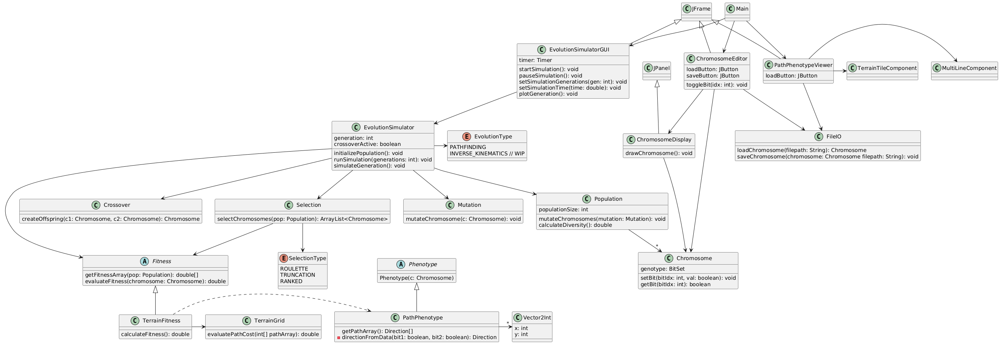
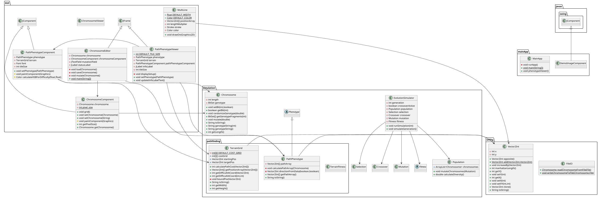
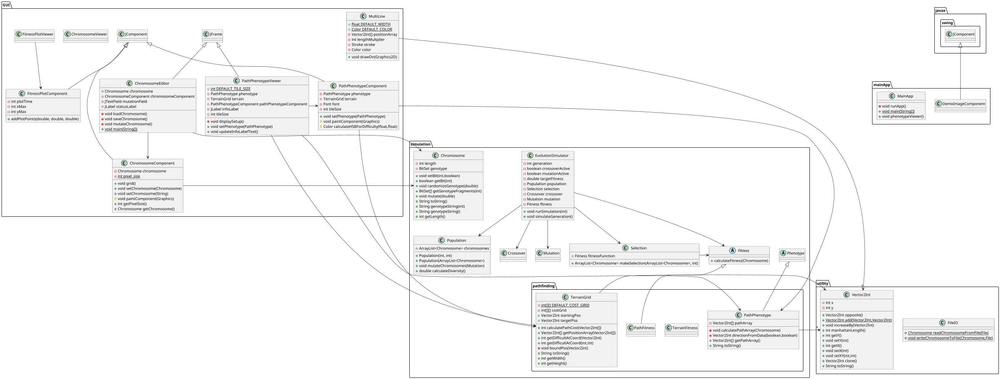

# CSSE 220 Milestone 1 Report
*Use this template for your M1, M2, M3, and M4 reports.*

**Project Title**: Genetic Algorithm Research Project

**Team Name**: f25r301

**Team ID**: f25r301

**Team Members and Role(s) for this Milestone**: 
- David Clutter (clutterda) $\to$ Tasks 2,3,8,9
- Baruni Cherukuri (cherukbj) $\to$ Tasks 4,5,6,7

---
## Section 1: Progress Summary and Individual Contributions
*TODO for Driver: Finished Milestone1 related tasks completely 

*TODO for Driver: List the role, main contributions, and estimations of time spent working on the project as a group (2 or more) and individually (working alone).*

| Name   | Role      | Main Contribution(s)                                                                 | Est. Hours with Group | Est. Hours Individually |
|--------|-----------|--------------------------------------------------------------------------------------|-----------------------|-------------------------|
| David  | Driver    | Tasks 2,3,8,9 Draft of UML identified a bug in code (null) Completed M1 report | 1 hours               | 4 hours                 |
| Baruni | Tester    | Tasks 4,5,6,7                                                                        | 1 hours               | 4 hours                 |

*TODO for Driver: Provide a direct link to your project repo's contributions page here, with the dates for this milestone selected. It will look something like this:
https://github.com/rhit-csse220/csse220-fall-2025-2026-final-project-f25r301

*This can be found by going to your team repo and then selecting
Insights->Contributors from the top menu
See this [comprehensive guide to viewing contributions](https://docs.github.com/en/repositories/viewing-activity-and-data-for-your-repository/viewing-a-projects-contributors).*

*If for some reason your contributions to do not show up, please review [this guide](https://docs.github.com/en/account-and-profile/setting-up-and-managing-your-github-profile/managing-contribution-settings-on-your-profile/why-are-my-contributions-not-showing-up-on-my-profile#your-local-git-commit-email-isnt-connected-to-your-account).*

[Link to Project Contributions Page](https://example.com)

## Section 2: UML Before and After

Original implementation:

Current Implementation:

*TODO for Navigator: Discuss the changes to your team's design.*
### Changes to design

These UML diagrams obviously look pretty different for one part because the original was painstakingly created manually in the 
PlantUML web app, while the other one was automatically generated from the code (although I still edited it to include
arrows between objects, something the generator apparently doesn't do by default).  The large visual difference is due 
to the auto-generator's decision to include packages in the names of classes, leading to a vastly different layout.

Many of the real changes came from the fact that the original UML didn't go into much depth with the structure of the GUI
elements, since at the time the team was less familiar with Swing, so we intentionally left things vague.  

*TODO for Navigator: Expand the current UML to include the next milestone's features.*

## Section 3: Testing
*TODO for Tester (or Navigator, on a team of size 2-3): Complete the below summary of your JUnit tests from this milestone. Every team is expected to add some JUnit tests as part of each milestone, but teams of size 2-3 are not expected to create as many test cases.*

### A. Testing code written for this milestone
- Test is located at `test/simulation/ChromosomeTest.java`
_____
- This test verifies that all testable functionality of the Chromosome works as intended.  (Functions that involve
randomization couldn't be fully tested since they weren't always deterministic, but were tested on 100% and 0%).
_____

### B. What is your **plan** for testing (writing a unit test(s)) in the next Milestone?
- We plan to test fitness, selection, and hamming distance functionality, since all of these are functions with a 
singular deterministic output.
_____
- Give examples of 3 different inputs and their expected outputs. (exact numbers not supplied as methods are not yet 
concrete)
   + Input: A single chromosome, representing a path.  
  Output: A double representing the fitness value of the chromosome, calculated by distance to target and total 
  difficulty
   + Input: Population of 12 chromosomes with an argument stating that 6 are to be selected.  
  Output: The 6 fittest chromosomes
   + Input: Two different chromosomes.
  Output: The hamming distance between them (the number of changes that would need to be made to turn one into the other)
_____

### C. Reflection on Testing Plan
- Did you have to adjust the originally planned test(s) for this Milestone? 
    + No, not really.
_____
- Describe how the implementation of the tests in this milestone was either easy or challenging. 
   + The implementation was fairly easy, as IntelliJ was able to generate a blank testing class for Chromosome, from 
  which we could easily test every testable method.  I suppose coming up with the tests was somewhat tedious, but it 
  wasn't at all challenging.
_____
